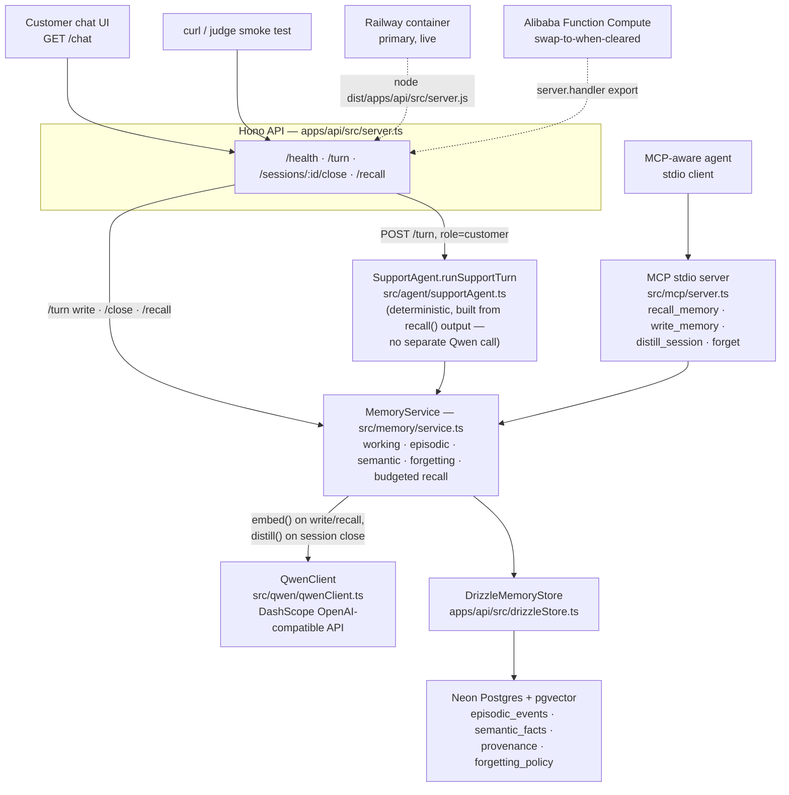

# Architecture

Never Ask Twice is a B2B support MemoryAgent. The system is intentionally small: a Hono API, a shared memory service, Qwen Cloud calls, Postgres with pgvector, and an MCP stdio surface over the same memory service.

## Full data flow

Same code, two deploy targets, selected purely by which env vars and start command run it (`DATABASE_URL` is the only thing that changes). Railway is live today; Alibaba FC is the preferred target and is a `DATABASE_URL` swap + redeploy away once Alibaba ID verification clears. See [Deployment shape](#deployment-shape) below.

## Components

| Component | Responsibility |
|---|---|
| `apps/api` | Hono API, local dev server, and Function Compute handler (`server.handler`) — deploy-target-agnostic, currently live on Railway. |
| `src/memory` | Shared memory service used by API, eval, and MCP. Implements all three tiers plus forgetting. |
| `src/agent` | Support agent (`runSupportTurn`): recalls context, detects missing required predicates, returns cited facts. Deterministic — built from `MemoryService.recall()` output, no separate Qwen call. |
| `src/qwen` | Single Qwen Cloud client using the DashScope OpenAI-compatible base URL. Handles embeddings (`embed`) and session distillation (`distill`). Conflict adjudication (`adjudicate`) exists on the client but is not yet wired into the memory service (cut-candidate). |
| `src/db` | Drizzle schema plus SQL migration for Postgres + pgvector (Neon). |
| `src/mcp` | stdio MCP server exposing memory tools (`recall_memory`, `write_memory`, `distill_session`, `forget`) without duplicating memory logic. |
| `eval` | Three-scenario deterministic harness: basic recall (Acme), supersession (Globex), TTL forgetting (Initech). Aggregate metrics across all three. |

## Memory tiers

- **Working memory:** facts stated in the current session before close/distillation.
- **Episodic memory:** raw events with embeddings and provenance.
- **Semantic memory:** distilled facts with confidence, validity windows, and source links.
- **Forgetting:** expired and superseded facts are excluded from recall without deleting provenance.

## Deployment shape

The judge-facing deployment is **Railway**, live now: see the README Status table for the current URL. The app is deploy-target-agnostic by design — `apps/api/src/db.ts` opens a plain `pg.Pool` from `DATABASE_URL`, so switching targets is a config change, not a code change. Postgres is Neon, reached as a normal long-lived connection from Railway's single container (no pgbouncer/pooling caveat).

Alibaba Cloud Function Compute remains the preferred target and is still fully wired: the root `s.yaml` points FC at `dist/apps/api/src/server.handler` (the `handler` export in `apps/api/src/server.ts`) after `pnpm build`. It is currently blocked on Alibaba ID verification, not on app readiness — swapping to it once that clears is a `DATABASE_URL` change and a redeploy. See [`deploy/railway.md`](../deploy/railway.md) for the live deployment and [`deploy/alibaba-fc.md`](../deploy/alibaba-fc.md) for the FC swap-over path.

The live path requires:

- `DATABASE_URL`
- `DASHSCOPE_API_KEY`
- `QWEN_BASE_URL=https://dashscope-intl.aliyuncs.com/compatible-mode/v1`
- `QWEN_CHAT_MODEL`
- `QWEN_EMBEDDING_MODEL=text-embedding-v3`
- `QWEN_EMBEDDING_DIM=1024`
- `MEMORY_TOKEN_BUDGET=1200`

## Local-safe mode

When `DASHSCOPE_API_KEY` is absent, the API still boots for local inspection. It returns zero-vector embeddings and empty distillation responses. That mode is for runnability only; it is not real Qwen work. Use `pnpm eval` for deterministic local scoring without secrets.
